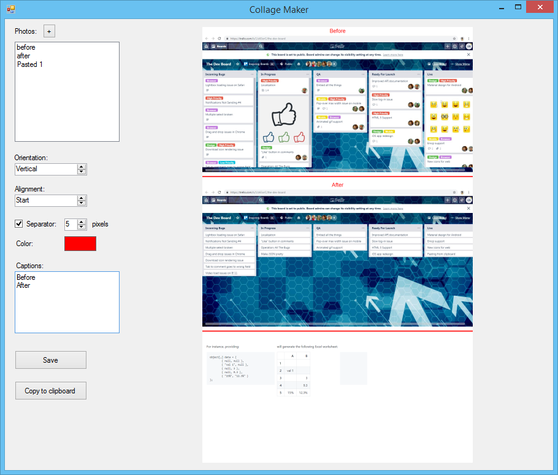

# Collage Maker

Simple tool to make screenshot collages with captions.

## Step 1

Add images to the **Photos** list - either paste from clipboard (`CTRL + V`) or use the **+** button to select a file or multiple files from disk.

Note: there is no option to reorder the images yet, but it is possible to remove them (one by one) by selecting and pressing `DEL` key.

## Step 2

Select options using controls below:
* Orientation of the collage: Horizontal / Vertical / Square (not implemented yet)
* Alignment of images in the collage in case one is shorted: Start / Middle / End
* Whether to display separator between images (if so, choose width and color)
* Captions for the images: put one caption per line. If there are less captions than images, the rest images will have no caption

## Step 3

Use either **Save** button to save the collage to disk, or **Copy to clipboard** button to copy the generated image directly to the clipboard.

## Building

Note that currently the project cannot be built from the source code because it depends on private libraries.
I will share them later.
